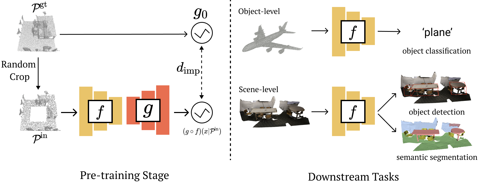

[](https://paperswithcode.com/sota/3d-point-cloud-linear-classification-on?p=implicit-autoencoder-for-point-cloud-self)

[](https://paperswithcode.com/sota/3d-point-cloud-classification-on-modelnet40?p=implicit-autoencoder-for-point-cloud-self)

# Implicit Autoencoder for Point Cloud Self-supervised Representation Learning 

<div align="center">
  
</div>

This repository contains the PyTorch implementation of paper: [Implicit Autoencoder for Point Cloud Self-supervised Representation Learning](https://arxiv.org/pdf/2201.00785.pdf).

## Installation

Our code is tested with Ubuntu 18.04, Python 3.6.7, Pytorch v1.4.0, TensorFlow v1.14, and CUDA 10.1.

First you have to make sure that you have all dependencies in place.

You can create an anaconda environment called `iae` using
```
conda env create -f environment.yaml
conda activate iae
```
**Note**: you might need to install **torch-scatter** mannually following [the official instruction](https://github.com/rusty1s/pytorch_scatter#pytorch-140):
```
pip install torch-scatter==2.0.4 -f https://pytorch-geometric.com/whl/torch-1.4.0+cu101.html
```

To compile the CUDA layers for PointNet++
```
cd src/encoder/pointnet2

python setup.py install
```

## Datasets

We pre-train our model on two different datasets, ShapeNet and ScanNet, for different downstream tasks. Please refer to `datasets` for more details.

## Usage

To train our model, run:
```
python train.py CONFIG.yaml
```
We provide different model config files under `configs` folder.

## Downstream Tasks

Please refer to README.md under `downstream_tasks` folders.

## Acknowledgements

We would like to thank and acknowledge referenced codes from

Convolutional Occupancy Network: https://github.com/autonomousvision/convolutional_occupancy_networks.

PointNet++ implementation in Pytorch: https://github.com/erikwijmans/Pointnet2_PyTorch.

DGCNN implementation in Pytorch: https://github.com/AnTao97/dgcnn.pytorch.

## Citation

If you find this repository useful in your research, please cite:

```
@article{yan2022implicit,
  title={Implicit Autoencoder for Point Cloud Self-supervised Representation Learning},
  author={Yan, Siming and Yang, Zhenpei and Li, Haoxiang and Guan, Li and Kang, Hao and Hua, Gang and Huang, Qixing},
  journal={arXiv preprint arXiv:2201.00785},
  year={2022}
}
```
